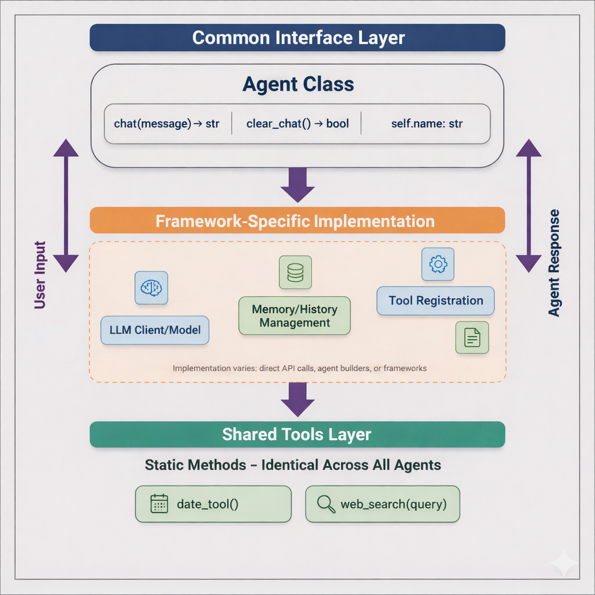

# Agent Framework Comparison Project
-----------

## Overview

This project provides a collection of examples demonstrating how to implement the same agent using different frameworks. The goal is to facilitate comparison and evaluation of various agent frameworks by providing a common interface and use case.
A simple UI is included to make testing more fun, but the main goal is to provide an simple way to compare the approaches to agent creation offered by each framework. 

The example agent is very simple. It's a decision support agent which has been given instructions to help a use follow a [decision making process](https://thedecisionlab.com/reference-guide/psychology/decision-making-process).

The agent has two tools it can use:
   - a date tool, which it can use to figure out what today's date it
   - a web search tool, which allows it to help the decision-making process by conducting some research on behalf of the user.

## Architecture

All agents in this project follow a common structure, regardless of the underlying framework:



This consistent architecture ensures fair comparison across frameworks. Each agent implements the same interface (common methods and tools), but uses framework-specific approaches internally. This design allows you to:

* **Compare implementations** - See how different frameworks solve the same problem
* **Swap agents easily** - All agents work with the same UI and have identical APIs
* **Understand trade-offs** - Observe how framework design affects code structure and behavior

## Project Structure

The project consists of the following components:

*   **Agent Implementations**: A set of Python modules, each implementing the agent using a different framework (e.g., `langchain_agent.py` files).
*   **Streamlit App**: A user interface application built using Streamlit, allowing users to interact with the agents and compare their behavior.

## Agent Frameworks

The following agent frameworks are currently implemented:

### Low-Level APIs
* **Anthropic API** (`anthropic_agent.py`) - Direct implementation using Anthropic's Messages API
  - Manual message array management with tool call while loop
  - Native tool calling via `client.messages.create()`
  - *Most straightforward with minimal abstraction - clean and direct*

* **OpenAI Responses API** (`openai_responses_agent.py`) - New Responses API (released March 2025)
  - Stateless design using `previous_response_id` for conversation chaining
  - Requires manual tool call orchestration via `_process_response()`
  - *Modern and clean but more boilerplate than Anthropic*

* **OpenAI Assistants API** (`openai_assistants_agent.py`) - Deprecated Assistants API (sunset: August 26, 2026)
  - Server-side thread management with polling loop (`time.sleep()`)
  - Stateful but slower due to polling overhead
  - *Kept for historical comparison; avoid for new projects*

### High-Level Agent SDKs
* **OpenAI Agents SDK** (`openai_agents_sdk_agent.py`) - Higher-level SDK built on Responses API
  - Runner pattern with `run_sync()` for automatic conversation handling
  - `@function_tool` decorator for clean tool registration
  - *Good balance of simplicity and control for OpenAI users*

### Agent Frameworks
* **Langchain** (`langchain_agent.py`) - Classic agent framework (2024 approach)
  - DEPRECATED: Shows pre-2025 patterns with `create_react_agent`
  - Pulls prompt template from hub, manual history tracking
  - *Heavy with lots of setup; kept for historical reference*

* **LangGraph** (`langgraph_agent.py`) - Graph-based agent execution
  - MemorySaver checkpointer with thread-based state management
  - Direct `system_prompt` parameter (simplified in 1.0+)
  - *More setup but offers fine-grained control over execution flow*

* **CrewAI** (`crewai_agent.py`) - Multi-agent orchestration framework
  - Creates fresh Task + Crew per message with manual history
  - Uses `role`, `goal`, and `backstory` structure
  - *Designed for multi-agent; single-agent use feels heavyweight*

* **Pydantic AI** (`pydantic_agent.py`) - Type-safe agent framework
  - Clean `run_sync()` API with automatic message history
  - `@tool` decorator with strong typing
  - *Lightweight and pythonic; great for type-safety enthusiasts*

* **Llama-Index** (`llama_index_agent.py`) - Data-aware agent framework
  - ReActAgent with async Workflows API (0.11+)
  - Requires async/sync bridging with `asyncio.run()` fallback
  - *More complex async handling but powerful for data-heavy workflows*

* **Atomic Agents** (`atomic_agent.py`) - Composable agent framework
  - v2.0 uses compile-time type parameters: `AtomicAgent[InputSchema, OutputSchema]`
  - Two-agent pattern (orchestrator + answer) required for dynamic outputs
  - *Strongly typed but verbose; steeper learning curve in v2.0*

* **Google ADK** (`google_adk_agent.py`) - Google's Agent Development Kit
  - App + Runner architecture with InMemorySessionService
  - LiteLLM integration for multi-model support, async wrapped in `asyncio.run()`
  - *Model-agnostic and flexible but adds architectural layers*

* **SmolAgents** (`smolagents_agent.py`) - HuggingFace's lightweight framework
  - ToolCallingAgent with LiteLLMModel, `@tool` decorator requires return type hints
  - `LogLevel.OFF` to suppress verbose output
  - *Very lightweight and simple; note: automatic tool generation not used here for fair comparison*

## Quick Comparison

| Framework | Complexity | Memory Pattern | Tool Registration | Notable Characteristic |
|-----------|-----------|----------------|-------------------|------------------------|
| **Anthropic API** | Low | Manual array | Direct function mapping | Cleanest low-level API with native tool calling |
| **OpenAI Responses** | Low-Med | Stateless + ID chaining | Manual orchestration | Modern but requires more boilerplate |
| **OpenAI Assistants** | Medium | Server-side threads | Server-managed | Deprecated; slow polling-based execution |
| **OpenAI Agents SDK** | Low-Med | Automatic (Runner) | `@function_tool` decorator | Best abstraction for OpenAI ecosystem |
| **LangChain** | Medium | Manual string conversion | Tool objects | Deprecated 2024 patterns; heavy setup |
| **LangGraph** | Medium-High | Checkpointer + threads | Tool objects | Fine-grained control via graph execution |
| **CrewAI** | Medium | Manual tracking | BaseTool subclasses | Multi-agent focused; task-based |
| **Pydantic AI** | Low-Med | Automatic history | `@tool` with typing | Clean and pythonic; type-safe |
| **LlamaIndex** | Medium-High | ChatMemoryBuffer | FunctionTool wrappers | Async-first; requires event loop handling |
| **Atomic Agents** | High | ChatHistory per agent | BaseTool with schemas | v2.0 type parameters; two-agent pattern |
| **Google ADK** | Medium | Session service | Function wrappers | Model-agnostic via LiteLLM; App+Runner |
| **SmolAgents** | Low | Agent memory | `@tool` with type hints | Lightweight; auto-tool-gen disabled here* |

*SmolAgents' automatic tool generation feature provides code-writing capabilities but was not used here to maintain fair comparison across frameworks.

## Getting Started

To run the project, follow these steps:

1.  Clone the repository: `git clone https://github.com/rachedblili/AgentExamples`
2.  Go into the project directory: `cd AgentExamples`
3.  Install the required dependencies: `pip install -r requirements.txt` (you may want to do this in a [Python virtual environment](https://realpython.com/python-virtual-environments-a-primer/))
4.  To actually run the agents, you need a Tavily AI Research API key.  You can get one here: https://tavily.com/
5.  Create a new file named `.env` in the project directory.
6.  Add your API keys to the `.env` file.  Example:
```commandline
TAVILY_API_KEY="put your tavily key in here"
OPENAI_API_KEY="put your OpenAI key in here"
ANTHROPIC_API_KEY="put your Anthropic key in here"
```
7.  Run the Streamlit app: `streamlit run agent-ui.py`

Note: You don't need to use the streamlit front-end. The agents can be run directly and will prompt you for input.

## Using the App

The Streamlit app provides a simple interface for interacting with the agents:

*   Select an agent type from the sidebar dropdown menu.
*   Type a message in the chat input field to send it to the selected agent.
*   The agent's response will be displayed in the chat history.
*   Use the "Clear Chat" button to reset the conversation.

## Contributing

Contributions to the project are welcome. If you'd like to add a new agent implementation or improve an existing one, please follow these guidelines:

*   Create a new Python module for the agent implementation, following the naming convention `XXX_agent.py`.
*   Ensure the agent implementation conforms to the common interface defined in the `agent-ui.py` file.
*   Submit a pull request with your changes, including a brief description of the new agent implementation.

## License

This project is licensed under the MIT license. 

## Acknowledgments

*   [The Decision Lab](https://thedecisionlab.com): Behavioral Science Applied to Decision-Making.
*   [Tavily](https://tavily.com/): The tool I used to power the agents' web search capability.
*   [OpenAI](https://openai.com/): A leading provider of AI research and development, including large language models and the OpenAI Agents SDK.
*   [Anthropic](https://www.anthropic.com/): A company focused on developing and applying AI technology, including Claude models.
*   [Langchain](https://github.com/langchain-ai/langchain): A framework for building applications that use large language models.
*   [LangGraph](https://github.com/langchain-ai/langgraph): A library used to create agent and multi-agent workflows.
*   [Llama-Index](https://github.com/run-llama/llama_index): A library for building and interacting with large language models.
*   [Pydantic AI](https://github.com/pydantic/pydantic-ai): A framework for building type-safe agents with LLMs.
*   [Atomic Agents](https://github.com/BrainBlend-AI/atomic-agents): A framework for building modular, composable autonomous agents.
*   [CrewAI](https://github.com/crewAIInc/crewAI): A popular framework for building multi-agent systems.
*   [Google ADK](https://github.com/google/adk-python): Google's Agent Development Kit for building flexible, code-first AI agents.
*   [SmolAgents](https://github.com/huggingface/smolagents): HuggingFace's lightweight, code-first agent framework.
